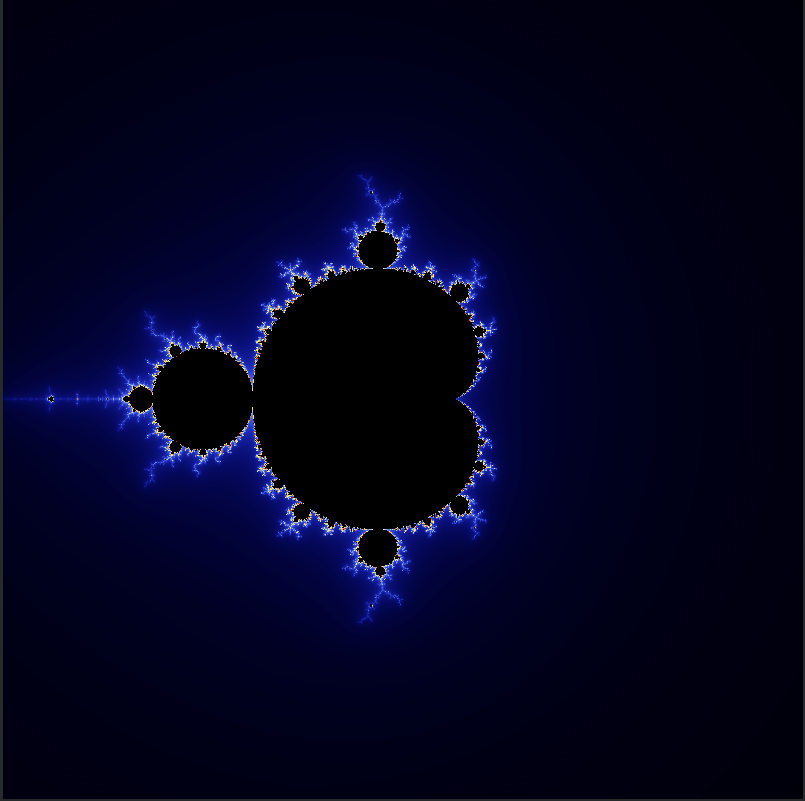

# Mandelbrot Set

## Introduction

The Mandelbrot set is the set of complex numbers `c` for which the function `f(z) = z^2 + c` does not diverge when iterated from `z = 0`, i.e., for which the sequence `f(0)`, `f(f(0))` etc., remains bounded in absolute value. Its definition is credited to Adrien Douady who named it in tribute to the mathematician Benoit Mandelbrot, a pioneer of fractal geometry. Mandelbrot set images may be created by sampling the complex numbers and testing, for each sample point `c0` whether the sequence `c0`, `f(c0)` etc., remains bounded. ([Wikipedia](https://en.wikipedia.org/wiki/Mandelbrot_set))

## Installation

To run the simulation, simply clone the repository and open the `index.html` file in your browser. Alternatively, you can visit the [GitHub Pages](https://ghostscypher.github.io/mandelbrot_set/src/index.html) for this repository.

## Implementation

The current implementation only renders the pattern once. The color scheme used is Bernstein's color scheme. The color scheme is as follows:

```javascript
let t = map(n, 0, MAX_ITERATIONS, 0, 1);

/**
 * Color scheme: Bernstein polynomials
 * https://en.wikipedia.org/wiki/Bernstein_polynomial
 * 
 * r(t) = 9 * (1 - t) * t3 * 255
 * g(t) = 15 * (1 -  t)^2 * t^2  *255
 * b(t) = 8.5 * (1 * t)^3  * t * 255
 */
let c_r = 9 * (1 - t) * t * t * 255;
let c_g = 15 * (1 - t) * (1 - t) * t * t * 255;
let c_b = 8.5 * (1 - t) * (1 - t) * (1 - t) * t * 255;
```

### Pseudocode

```pseudocode
for each pixel (Px, Py) on the screen do
    x0 := scaled x coordinate of pixel (scaled to lie in the Mandelbrot X scale (-2.5, 1))
    y0 := scaled y coordinate of pixel (scaled to lie in the Mandelbrot Y scale (-1, 1))
    x := 0.0
    y := 0.0
    iteration := 0
    max_iteration := 1000
    while (x×x + y×y ≤ 2×2 AND iteration < max_iteration) do
        xtemp := x×x - y×y + x0
        y := 2×x×y + y0
        x := xtemp
        iteration := iteration + 1

    color := palette[iteration]
    plot(Px, Py, color)
```

## Usage

The simulation is not very interactive.
1. To iterate through a set of julia sets, press the `n` key. This will iterate through a set of julia sets and display them on the screen.

## Demo

### Mandelbrot Set



### Julia Set


## References

1. [Mandelbrot Set - Wikipedia](https://en.wikipedia.org/wiki/Mandelbrot_set)
2. [P5 JS](https://p5js.org/)
3. [P5 JS Reference](https://p5js.org/reference/)
4. [P5 JS Examples](https://p5js.org/examples/)
5. [P5 JS Web Editor](https://editor.p5js.org/)
6. [Coding train - P5 JS Tutorials](https://www.youtube.com/user/shiffman/playlists?view=50&sort=dd&shelf_id=14)
7. [The Nature of Code](https://natureofcode.com/)
8. [The Coding Train](https://thecodingtrain.com/)
9. [The Coding Train - Mandelbrot Set](https://www.youtube.com/watch?v=6z7GQewK-Ks)